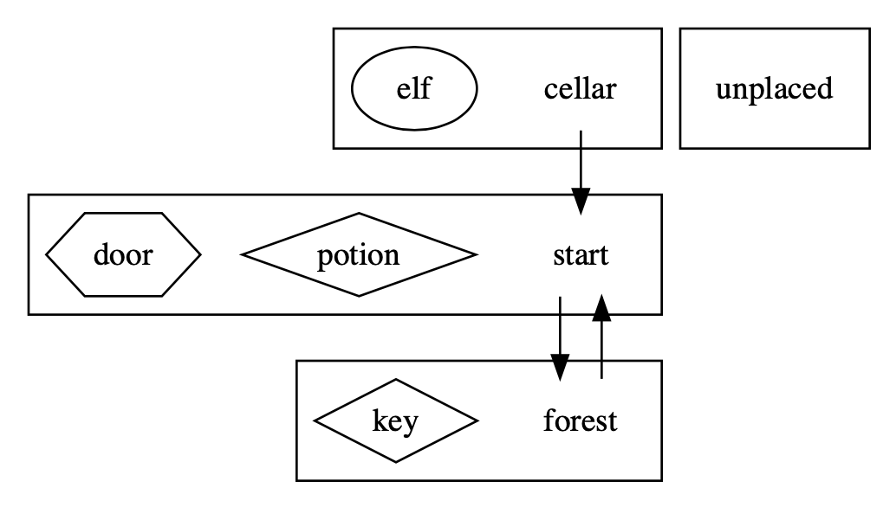

# STAG
A general-purpose socket-server game-engine for text adventure games

## Game Server
    $ java StagServer entities.dot actions.json
The game description files passed into the server contain the following two aspects of the game:

1. Entities: "things" in the game, their structural layout and the relationships between them

2. Actions: the dynamic behaviours of the entities within the game

Because these two types of data are very different in nature, two different documents formats were chosen to represent them:

1. DOT: A language for expressing graphs (which is basically what a text adventure game is!)
2. JSON: A language for expressing structured data (which will be used to store the actions)

### Game Entities
Each game consists of a number of different "entities" (as described in the "entities.dot" file). There are a number of different types of entity, including:

* Locations: Rooms or places within the game
* Artefacts: Physical "things" within the game (that can be collected by the player)
* Furniture: Physical "things" that are an integral part of a location (they can NOT be collected by the player)
* Characters: Creatures or people involved in game
* Players: A special kind of character that represents the user !

All entities need at least a name and a description, some may need additional attributes as well. It is worth mentioning that any entity names defined in the configuration files will be unique and will be used as unique identifiers.

It is worth noting that "**Locations**" are complex constructs and as such have various different attributes in their own right, including:

* Paths to other Locations (note: it is possible for paths to be one-way!)
* Characters that are currently at a Location
* Artefacts that are currently present in a Location
* Furniture that belongs in a Location

Also, every game has a "special" location that is the starting point for an adventure. This starting point is always the first location that is encountered when reading in the "entities" file.

There is another special location called "unplaced" that can be found in the entities file. This location does not appear in the game world, but is rather a container for all the entities that have no initial location. They need to exist somewhere in the game structure so that they can be defined, but they do not enter the game until an action places then in another location within the game.

The big benefit of using DOT files to store game entities is that are numerous existing tools for visualising them - we can SEE the structure of the game configuration. The image below visually shows the structure of the basic entities file. As you can see, each location is represented by a box containing a number of different entities (each type of entity being represented by a different shape). The paths between locations are also presented as directed arrows.

### Game Actions
Dynamic behaviours within the game are represented by "Actions", each of which has the following elements:
* A set of possible "trigger" words (ANY of which can be used to initiate the action)
* A set of "subjects" entities that are acted upon (ALL of which need to be present to perform the action)
* A set of "consumed" entities that are all removed ("eaten up") by the action
* A set of "produced" entities that are all created ("generated") by the action

>Note:
> * "Being present" requires the entity to either be in the inventory of the player invoking the action or for that entity to be in the room/location where the action is being performed.
> * Action names are NOT unique - for example there may be multiple "open" actions that act on different entities.

### Communication
In order to communicate with the server, we need an agreed language (otherwise the user won't know what to type to interact with the game !) 
There are a number of standard "built-in" gameplay commands that game engine will respond to:

* "**inventory**" (or "inv" for short): lists all the artefacts currently being carried by the player
* "**get**": picks up a specified artefact from current location and puts it into player's inventory
* "**drop**": puts down an artefact from player's inventory and places it into the current location
* "**goto**": moves from one location to another (if there is a path between the two)
* "**look**": describes the entities in the current location and lists the paths to other locations

In addition to the standard "built-in" commands, game engine will also accept ANY of the trigger keywords from the loaded-in game actions file. 

## Game Client
This game engine is able to operate with multiplayer through the StagClient.
To run Client, use:

    $ java StagClient [playerName]

### Player
In order to identify which player has issued the command, each incoming command message will begin with a username, a full incoming message might therefore take the form of:
    
    Zev: open door with key

Each player may be in a different location and will carry their own inventory of items.

"**Health Level**" feature is an extension to the basic game, each player start with a health level of 3. Consumption of "Poisons & Potions" or interaction with beneficial or dangerous characters will increase or decrease a player's health. The use of the "health" keyword could be in the consumed and produced fields.

When a player's health runs out (i.e. reaches zero) they will lose all the items in their inventory (which are dropped in the location where they ran out of health) and then they will return to the start location.
